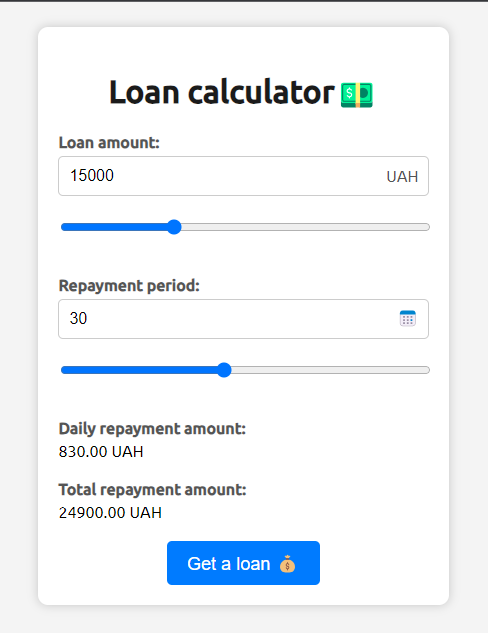
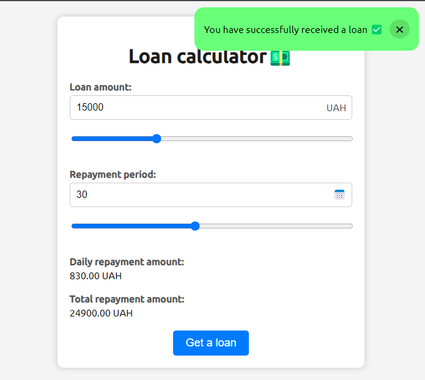

# Vanilla JS loan calculator

Веб-додаток для обрахунку кредиту. В калькулятор можна вводити суму позики та період погашення, а потім відображати денну суму погашення та загальну суму погашення.

## Проект запускається за допомогою Live Server

В проекті по суті реалізована форма з валідацією полів введення користувача.

Також два типи інпутів (типів: range та number) мають своєрідне "двостороннє зв'язуваання" між собою.

Обчислені суми виплат обраховуються при зміні введень одразу. Обчислення не відбувааються при не коректному введенні.

При submit-i форми відбувається імітація "запиту" та виведенні toast-нотифікації на екран через 1 секунду.

## Інтерфейс застосунку:

